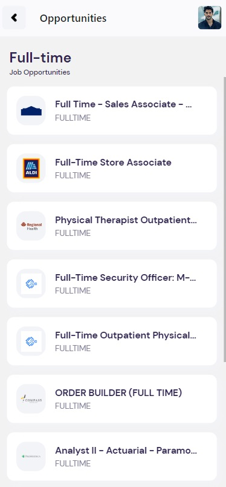
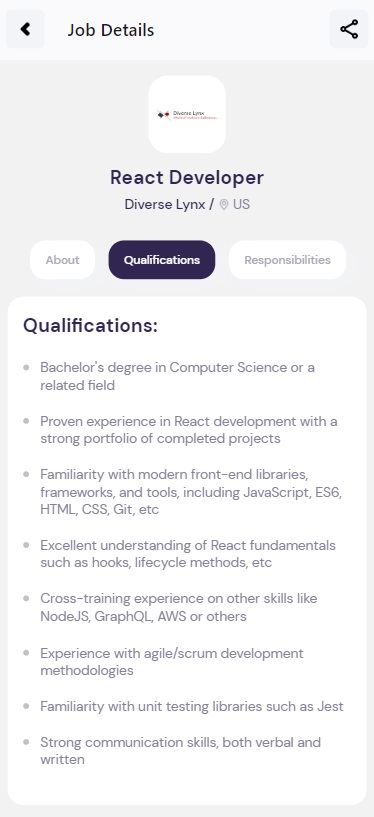

# Jobs

Um aplicativo funcional, que pesquisa vagas de trabalho em diversas plataformas de trabalho, utilizando Rapid Api, a partir de uma arquitetura realizada em React Native como principal base de construção.

### Para sua utilização, é necessário um arquivo **.env** que conhtenha no mínimo, estas informações:

```
    X_RapidAPI_Host="HOST DA API (JSEARCH)"
    X_RapidAPI_Key="CHAVE AO SE REGISTRAR NO SITE RAPID API"
```

### Imagens do projeto:

Tela inicial do aplicativo


Listagem das vagas próximas ao usuário, com base no texto pesquisado



Sobre a vaga


